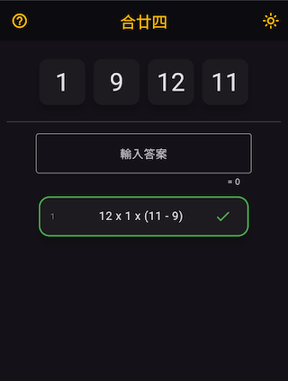

# combine24 (合廿四)

combine24 (合廿四) is an interactive "24 game" solver built with Flutter. The Chinese name means "combine 24" - the classic mathematical puzzle where you must use each of four given numbers exactly once, combining them with addition, subtraction, multiplication, division, and parentheses to make exactly 24.

Live demo: [combine24.vercel.app](https://combine24.vercel.app/)


## Features

- Interactive custom formula keyboard with numbers, operators, and parentheses
- Live subtotal preview while you type
- Hint system that reveals partial solutions (tap to copy into the answer box)
- Flip animation between empty/hint/solution cards
- **Dual card selection modes**: Random draw for a new hand or manually pick your own four numbers
- Pull to refresh to reset the current round
- Light/Dark theme toggle
- Web, iOS, Android, and desktop-ready (Flutter)

## How to Play

- **Random draw**: Tap the floating action button (bottom right) to get four random cards
- **Manual selection**: Tap the card area to manually pick your own four numbers
- **Use each card once**: Each number can only be used exactly once
- **Calculate 24**: Combine numbers with +, −, ×, ÷ and parentheses to make exactly 24
- **Input expressions**: Use the on-screen formula keyboard to enter your mathematical expressions
- **Get hints**: When stuck, tap hint cards to reveal partial solutions

## Solution Deduplication & Normalization

<table>
  <tr>
    <td align="center" valign="top">
      
      <br>
      <em>Simple permutations of cards and operations</em>
    </td>
    <td align="center" valign="top">
      
      <br>
      <em>Deduplicated solution</em>
    </td>
  </tr>
</table>

- **Normalize equivalent expressions**: Treat mathematically identical solutions as the same, regardless of operand order for commutative operations (+ and ×)
- **Filter invalid solutions**: Remove expressions that produce fractional or negative intermediate results during calculation
- **Consolidate trivial operations**: Group together mathematically meaningless operations like multiplying or dividing by 1

For more detail explaination on the formula schema, see: [Formula Schema Documentation](http://htmlpreview.github.io/?https://github.com/jkclee123/combine24/blob/main/docs/forula_schema.html)

## Local Development

Prerequisites:

- Flutter SDK with Dart 3.x (the project enforces `environment: ">=3.0.0 <4.0.0"`)
- Recommended: Flutter 3.10.x or later

Install and run (web):

```bash
flutter pub get
flutter run -d chrome
```

Run on mobile/emulator:

```bash
flutter devices
flutter run -d <device_id>
```

Build for web:

```bash
flutter build web --release
```

## Tech Stack

- **Framework**: Flutter + Dart 3.x
- **State Management**: `flutter_bloc` (BLoC pattern implementation)
- **Expression Parsing**: `function_tree` (mathematical expression evaluation)
- **UI Components**: `responsive_grid` (responsive layouts), `keyboard_actions` (custom keyboard handling)
- **Utilities**: `equatable` (value equality), `tuple` (immutable tuples), `collection` (enhanced collections)

## Project Structure (high-level)

- `lib/app.dart` — App root, theme provider, routing to `HomePage`
- `lib/pages/home/` — Home screen BLoC, state, and view
  - `views/formula_keyboard.dart` — custom on-screen keyboard
  - `views/home_view.dart` — layout, hints/solutions, interactions
- `lib/services/` — solution & answer services
  - `impl/default_solution_service.dart` — generates valid 24 formulas
  - `impl/default_answer_service.dart` — normalizes and matches answers
- `lib/utils/` — math and operator utilities
- `web/` — PWA manifest and icons

## Notes

- Solver rules align with common 24-game conventions: use each number once; operators are + − × ÷; parentheses allowed. The solver filters out trivial variations (e.g., some divide-by-1 forms) and normalizes equivalent expressions when matching your answer.
- The app is fully client-side; solutions are computed locally in the browser/device.